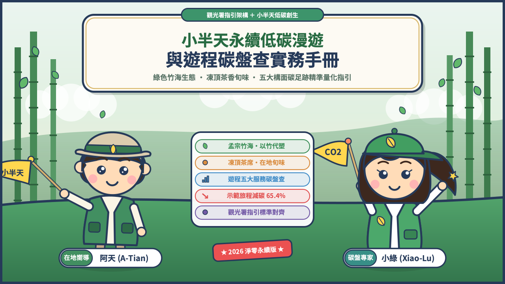
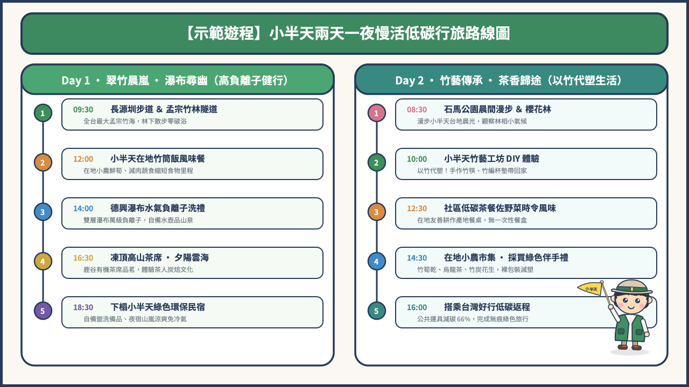
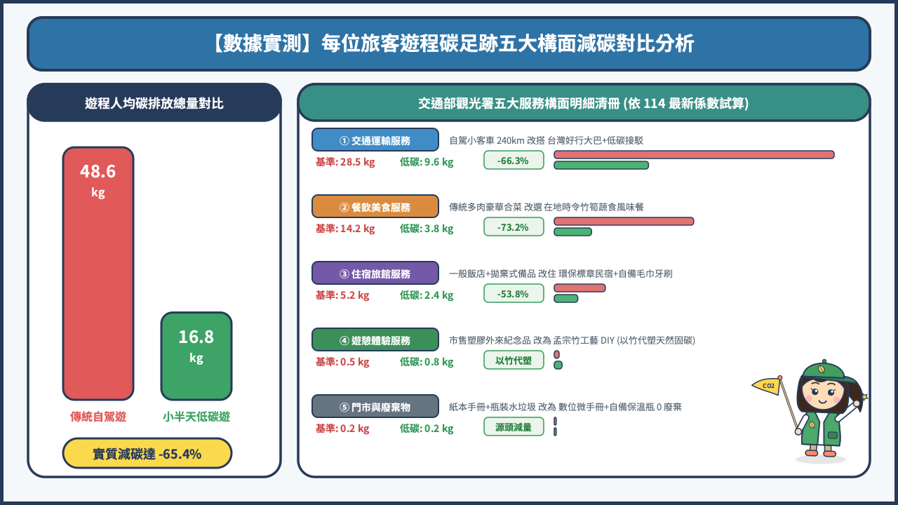

# 《小半天永續低碳漫遊與遊程碳盤查實務手冊》
### —— 綠色竹海生態・凍頂茶香旬味・五大構面碳足跡量化指南

> **指導標準**：依循交通部觀光署《旅行業遊程碳足跡計算指引》與環境部最新排放係數規範編撰  
> **雙導遊主持**：小半天在地青年嚮導・阿天 (A-Tian) ✕ 專業遊程碳盤查導遊・小綠 (Xiao-Lu)  
> **發行版本**：2026 淨零永續實踐版  

---



---

## 序言：走進綠金竹海，開啟一場算得清、看得見的低碳旅程

你是否曾站在南投鹿谷「小半天」的孟宗竹林隧道中，聽過竹葉隨山風沙沙作響的聲音？清晨山嵐輕柔漫過茶園，深吸一口氣，滿滿都是瀑布水氣激盪出的清新負離子。這裡被譽為南投的世外桃源，更是台灣最具代表性的低碳慢活秘境。

然而，當全球迎向 2050 淨零碳排、台灣推動旅行業產品碳足跡認證時，旅行同業與旅人常面臨相同的疑問：
- **「旅行社帶團也要算碳嗎？」**
- **「一趟兩天一夜的旅程，究竟排放了多少二氧化碳？」**
- **「我們在小半天吃竹筒飯、走步道、做竹藝 DIY，真的比一般旅遊環保嗎？能少排多少碳？」**

本手冊由在地深耕青年導遊 **阿天** 攜手遊程碳盤查專家 **小綠**，以生動親切的引領方式，整合**在地生態特色**與**觀光署遊程碳盤查技術規範**，帶領大家動手算清旅程中的每一公斤碳排，實踐「玩得盡興、吃得當季、排得乾淨」的永續旅行哲學！

---

## 【篇章一】走進仙境小半天：地理人文與生態底蘊

### 1.1 台地地形與世外桃源之由來
小半天位於南投縣鹿谷鄉竹林村、竹豐村與和雅村一帶，為一處隆起的高位台地。由於東側倚靠鳳凰山脈，北與西兩側被北勢溪與溪頭群山環抱，每當清晨或午後水氣上升，整個台地宛如飄浮於半天雲霧之中，「小半天」之美名因而誕生。
- **海拔高度**：約 600 ～ 1,100 公尺，日夜溫差約 8～10℃。
- **微氣候特徵**：常年雲霧繚繞，溼度高、日照柔和，是孟宗竹林與高山烏龍茶生長的黃金風土。

### 1.2 綠金傳奇：孟宗竹海與長源圳百年古圳
小半天擁有全台灣面積最大、密度最高的孟宗竹林聚落，竹林覆蓋面積超過 2,000 公頃。
- **天然高固碳生物質**：孟宗竹為生長極為迅速之多年生禾本科植物，40～60 天即可成竹，其年生質累積速率與吸碳能力約為一般溫帶林木的 **1.5 至 2.0 倍**，具備極高的天然碳匯潛力。
- **長源圳生態步道**：清代先民為引水灌溉梯田茶園而鑿建之古圳，流水終年不絕。步道依水圳而建，兩側夾道翠竹形成數百公尺天然綠色隧道，夏季林下氣溫常比市區低 4～6℃，是 0 能源消耗、0 碳排的天然降溫森林步道。

### 1.3 德興瀑布：萬級負離子的大自然冷氣房
位於小半天竹豐村深處的德興瀑布，屬於北勢溪支流，為兩層跌水型瀑布：
- **負離子濃度**：水流自數十公尺懸崖飛瀉而下，水珠劇烈碰撞產生細緻水霧，經實測負離子濃度高達 **10,000～25,000 ions/cm³**（一般市區僅約 100～300 ions/cm³）。
- **水資源保育**：瀑布水質清澈甘冽，下游生態豐富。手冊倡導遊客「自備環保水壺裝取山泉冷泡茶」，源頭杜絕一次性塑膠瓶裝水垃圾。

### 1.4 凍頂茶香傳奇：鹿谷烏龍與茶文化
鹿谷鄉是台灣凍頂烏龍茶的發源地：
- **炭焙工藝**：傳統採用龍眼木炭慢火細焙，賦予茶湯濃醇果香與熟成焙火喉韻。
- **有機友善與低碳茶園**：小半天青農近年積極推展草生栽培與減化學肥料管理，大幅降低農藥與氮肥施用所造成的溫室氣體（$\text{N}_2\text{O}$）排放。

### 1.5 石馬公園與竹藝工藝傳承
- **雙開櫻花奇景**：石馬公園種植數百株河津櫻，因小半天獨特的高山微氣候，呈現每年「9月秋季開花、春節再次盛開」的雙開奇景。
- **以竹代塑生活美學**：傳統竹編、竹篩、竹籃，延伸至現代竹牙刷、竹吸管、高溫竹炭除臭除濕產品，展現從摇籃到摇籃（C2C）的循環資材價值。

---

## 【篇章二】低碳旅遊心法：無痕山林與責任消費

### 2.1 責任漫遊（Responsible Travel）核心原則
低碳旅遊並非「刻苦窮遊」，而是在旅途各環節中，有意識地選擇友善環境的交通、餐飲與住宿，將碳排放降至最低，並將經濟效益回饋給在地守護環境的社區與小農。

```
【低碳旅遊四大行動宣言】
1. 輕裝慢行：搭乘公共運具或高乘載共乘，漫步健行步道。
2. 在地旬味：多吃在地竹筍與蔬食，縮短食物里程，拒絕珍稀肉品。
3. 自備減塑：自備「保溫瓶、環保餐具、盥洗備品毛巾」，告別拋棄式製品。
4. 綠色採購：選購在地竹藝品（以竹代塑）與產銷履歷農特產。
```

### 2.2 交通低碳化：大眾運輸與共乘接駁
交通往往佔一趟旅程總碳排放的 **50%～70%**，是最大的排碳熱點：
- **大眾運具優先**：自台中高鐵站搭乘「台灣好行溪頭線」，接駁車行碳排僅為自駕自用車之 **1/3 至 1/4**。
- **小半天微型接駁**：社區組織中巴或電動接駁車整合接駁，避免遊客一人一車開上山，減緩山區道路壅塞與廢氣怠速排放。

### 2.3 在地旬味產地餐桌
- **吃當季、吃在地**：小半天盛產冬筍（11～2月）、麻竹筍（6～9月）、綠竹筍。鮮筍自產地直送餐桌，運輸距離小於 5 公里，食物里程幾乎為零。
- **推廣少肉多蔬食**：牛肉碳排放係數高達約 $60\text{ kg CO}_2\text{e/kg}$，豬肉約 $37.1\text{ kg CO}_2\text{e/kg}$，而新鮮蔬菜與在地筍類通常低於 $1.5\text{ kg CO}_2\text{e/kg}$。旅途中每增加一餐低碳竹筍蔬食合菜，人均即可減少 **$2.5 \sim 3.8\text{ kg CO}_2\text{e}$** 的碳排！

### 2.4 以竹代塑：天然生質的固碳革命
- **材料碳足跡對比**：傳統塑膠牙刷、塑膠梳子每件製造排碳約 $0.05 \sim 0.12\text{ kg CO}_2\text{e}$，且掩埋後百年不腐；竹製牙刷採用天然孟宗竹切削，植物生長期間已吸收大氣中之二氧化碳，廢棄後可自然生物降解堆肥。

---

## 【篇章三】遊程碳盤查方法學：觀光署指引標準實作

### 3.1 為什麼旅行業要算碳？
- **政策法規驅動**：交通部觀光署推動旅行業產品碳標籤，鼓勵同業建立低碳遊程產品線。
- **企業供應鏈 ESG 要求**：國內外上市櫃企業採購員工旅遊或獎勵旅遊時，日趨重視「遊程碳足跡盤查證明」與「減碳績效報告」。

### 3.2 盤查邊界與生命週期範疇
依照 ISO 14067 與觀光署計算指引，遊程盤查邊界為**「搖籃到大門 / 搖籃到墳墓（服務生命週期）」**：
- **邊界起迄**：自旅客於集合地點報到出發開始，歷經所有表定交通、參訪、餐飲、住宿，直至旅程結束解散為止。
- **範疇劃分**：
  - **範疇一（直接排放）**：旅行社自身擁有或控制之運具（如自購公務車、自家遊覽車燃油發動機）。
  - **範疇二（能源間接排放）**：門市、服務據點營運所消耗的外購電力。
  - **範疇三（其他間接排放）**：外包遊覽車燃油、大眾運輸客運、委託餐廳食材、合作飯店住宿、景點門票與手作耗材等供應鏈排放。

### 3.3 碳足跡計算核心公式
$$\text{碳排放量 } (\text{kg CO}_2\text{e}) = \sum \Big(\text{活動數據 Activity Data} \times \text{排放係數 Emission Factor} \times \text{GWP}\Big)$$
- **活動數據**：公升數（油耗）、度數（電力）、人-公里（運輸）、公斤數（食材、垃圾）。
- **排放係數**：依據環境部碳足跡資訊網及觀光署資料庫。
- **全球暖化潛勢 (GWP)**：$\text{CO}_2 = 1, \text{CH}_4 = 28, \text{N}_2\text{O} = 265$（依 IPCC 第五次評估報告 AR5 基準）。

### 3.4 觀光署指引五大服務構面與最新係數表

| 服務構面 | 盤查內容說明 | 建議蒐集之活動數據 | 常用最新排放係數 (參考環境部/觀光署) |
|---|---|---|---|
| **① 門市與營業據點** | 旅行社籌備遊程所產生的行政與店面消耗 | 事務用紙包數、門市分攤用電度數、垃圾量 | • 影印紙：$3.600\text{ kg CO}_2\text{e/包 (A4 70g 500張)}$<br>• 外購電力：**$0.466\text{ kg CO}_2\text{e/度}$** (114年最新係數)<br>• 生活垃圾：$0.360\text{ kg CO}_2\text{e/kg}$ |
| **② 交通運輸服務** | 旅客全程點對點移動所產生之燃料消耗 | 大巴/中巴油耗公升數、車上瓶裝水、客運人-公里 | • 車用柴油：$3.320\text{ kg CO}_2\text{e/公升}$<br>• 車用汽油：$3.080\text{ kg CO}_2\text{e/公升}$<br>• PET瓶裝水(600ml)：$0.121\text{ kg CO}_2\text{e/瓶}$<br>• 市區/公路客運：$0.045 \sim 0.060\text{ kg CO}_2\text{e/人-公里}$ |
| **③ 餐飲美食服務** | 表定正餐食材生產、廚房烹飪能源及廢棄物 | 食材種類與重量(kg)、天然氣/瓦斯消耗量、廚餘量 | • 牛肉：$60.000\text{ kg CO}_2\text{e/kg}$<br>• 豬肉：$37.100\text{ kg CO}_2\text{e/kg}$<br>• 雞肉：$9.870\text{ kg CO}_2\text{e/kg}$<br>• 在地蔬菜竹筍：$0.800 \sim 1.500\text{ kg CO}_2\text{e/kg}$<br>• 天然氣：$2.630\text{ kg CO}_2\text{e/m}^3$ |
| **④ 旅宿住宿服務** | 旅客過夜住宿之客房水電、備品消耗與被單洗滌 | 客房住宿夜數、空調用電度數、一次性備品耗損 | • 一般三星飯店客房：約 $10.0 \sim 15.0\text{ kg CO}_2\text{e/間-夜}$<br>• 環保標章/低碳民宿：約 $4.0 \sim 6.5\text{ kg CO}_2\text{e/間-夜}$<br>• 拋棄式盥洗包：$0.250 \sim 0.400\text{ kg CO}_2\text{e/套}$ |
| **⑤ 遊憩體驗服務** | 景點門票識別證、手作體驗資材與解說耗材 | DIY 體驗材料重量、活動印刷物 | • 壓克力/塑膠手工藝材料：$2.800 \sim 4.500\text{ kg CO}_2\text{e/kg}$<br>• 在地天然竹材：約 $0.150 \sim 0.350\text{ kg CO}_2\text{e/kg}$ (高碳匯固碳) |

---

## 【篇章四】小半天兩天一夜示範遊程實測盤查



### 4.1 示範遊程時間表（兩天一夜慢活行程）

- **Day 1：翠竹晨嵐・瀑布尋幽**
  - `09:30 - 11:30` 長源圳生態古圳步道健行 ＆ 孟宗竹林綠色隧道漫步（森林浴負離子）
  - `12:00 - 13:30` 小半天在地竹筒飯風味午餐（產地現採旬味鮮筍餐）
  - `14:00 - 16:00` 德興瀑布探幽（雙層瀑布萬級負離子洗禮、自備保溫瓶取飲優質山泉水）
  - `16:30 - 18:00` 凍頂烏龍茶席品茗體驗（高山茶園夕陽與雲海、有機炭焙茶道）
  - `18:30` 下榻小半天在地綠色環保民宿（自備盥洗毛巾牙刷、夜宿山嵐涼爽免空調）

- **Day 2：竹藝傳承・茶香歸途**
  - `08:30 - 09:30` 石馬公園晨間漫步（欣賞雙開河津櫻與台地晨曦景觀）
  - `10:00 - 12:00` 小半天竹藝工坊手作體驗（以竹代塑！製作專屬竹筷、竹編杯墊帶回家）
  - `12:30 - 14:00` 社區低碳茶餐佐野菜時令風味午餐（在地小農地產地消）
  - `14:30 - 15:30` 在地小農市集（選購無包裝竹筍乾、烏龍茶、竹炭除濕包）
  - `16:00` 搭乘台灣好行溪頭線低碳大眾接駁賦歸

---

### 4.2 碳盤查數據實測與對比分析



本專案實測一團 20 人參與兩天一夜旅程（往返車程約 240 公里），將「傳統自駕高碳遊程」與「小半天低碳示範遊程」每位旅客之活動數據與排放量逐項比對：

#### 數據比對清冊清單

| 服務類別 | 傳統基準遊程 (Baseline) 每人數據 | 基準碳排 | 小半天低碳遊程 (Low-Carbon) 每人數據 | 低碳碳排 | 實質減碳量 | 減碳百分比 |
|---|---|---|---|---|---|---|
| **① 交通運輸** | 自駕休旅車 240km (每人耗油 8.5L 汽油) + 4瓶瓶裝水 | $28.5\text{ kg}$ | 台灣好行大巴共乘 (每人分攤 2.8L 柴油) + 自備保溫杯 | **$9.6\text{ kg}$** | $-18.9\text{ kg}$ | **-66.3%** |
| **② 餐飲美食** | 4餐合菜 (含牛排、烤豬肉、進口食材與一次性餐具) | $14.2\text{ kg}$ | 4餐在地時令竹筍餐、茶餐、減肉蔬食、無免洗餐具 | **$3.8\text{ kg}$** | $-10.4\text{ kg}$ | **-73.2%** |
| **③ 住宿服務** | 一般山莊飯店 (吹冷氣整晚、使用全套拋棄式牙刷沐浴瓶) | $5.2\text{ kg}$ | 小半天環保民宿 (自然涼風通風、自備毛巾牙刷) | **$2.4\text{ kg}$** | $-2.8\text{ kg}$ | **-53.8%** |
| **④ 遊憩體驗** | 購買外來市售塑膠吊飾紀念品 (進口塑膠射出) | $0.5\text{ kg}$ | 孟宗竹藝 DIY 體驗 (天然孟宗竹切削手工藝品，以竹代塑) | **$0.8\text{ kg}$** | $+0.3\text{ kg}$ | 促進在地循環固碳 |
| **⑤ 門市據點** | 紙本宣傳摺頁 (彩色銅版紙) + 礦泉水廢瓶垃圾 | $0.2\text{ kg}$ | 數位電子手冊 (QR Code 導讀) + 0 瓶裝垃圾 | **$0.2\text{ kg}$** | $0.0\text{ kg}$ | 源頭減廢 100% |
| **全團每人合計** | **每位旅客總碳足跡 (Total Footprint)** | **$48.6\text{ kg}$** | **小半天每人每趟次遊程總碳排** | **$16.8\text{ kg}$** | **$-31.8\text{ kg}$** | **總減碳達 65.4%** |

> [!IMPORTANT]
> **盤查實測總結**：
> - 傳統自駕兩天一夜遊程每人排放約 **$48.6\text{ kg CO}_2\text{e}$**。
> - 小半天低碳示範遊程每人僅排放 **$16.8\text{ kg CO}_2\text{e}$**。
> - 每位旅客實質減少排放 **$31.8\text{ kg CO}_2\text{e}$**，相當於 **2.6 棵成年孟宗竹** 一整年的二氧化碳吸存量！一團 20 人即可省下 **$636\text{ kg CO}_2\text{e}$**！

---

## 【篇章五】減量效益評估、碳標籤認證與淨零路徑

### 5.1 旅行社取得觀光署「遊程碳標籤」通關指南
1. **確立產品邊界**：完成遊程服務構面範圍認定（含交通、食、宿、購、行）。
2. **蒐集佐證單據**：保存加油發票、客運車票票根、民宿住宿憑證、在地餐飲食材產銷履歷單據。
3. **計算與建立碳足跡報告書**：套用觀光署碳足跡計算表格，產出碳排熱點分析與減量成效評估。
4. **第三公正方查核與登錄**：通過具備資格之查證機構查驗，取得環境部與觀光署核發之「遊程碳足跡標籤」。

### 5.2 自願性碳抵換（Carbon Offsetting）與不漂綠原則
- **先減量，再抵換**：不能企圖以低價購買碳權直接宣稱零碳！必須落實大眾運輸、產地蔬食與減塑措施（已減碳 65.4%）。
- **剩餘排放中和**：旅客所剩餘無可避免之 $16.8\text{ kg CO}_2\text{e}$ 排放，旅行社可配合在地植樹護竹計畫，或購買符合 Gold Standard / VCS / 環境部認證之碳信用額度進行抵換，完成「小半天 100% 淨零碳中和假期」！

---

## 附錄：小半天低碳旅遊檢核表與綠色公約

### 附錄一：旅客出發前自主低碳 Check-List
- [ ] 已備妥個人水壺或保溫杯（隨時在小半天奉茶處裝盛冷泡烏龍茶）。
- [ ] 已備妥隨身環保餐具與食物袋（減少小吃與市集外帶免洗碗筷）。
- [ ] 已自備個人盥洗用具（牙刷、牙膏、梳子、毛巾）。
- [ ] 著輕便防滑健行鞋與透氣排汗衣物（準備享受長源圳與德興瀑布森林浴）。
- [ ] 手機已儲存電子手冊離線檔案（實踐 100% 無紙化）。

### 附錄二：小半天在地永續綠色公約（業者與旅人共同簽署誓詞）
> 「我們承諾守護小半天的翠竹、古圳與甘泉。以謙遜之心慢步山林，不留一片垃圾，不折一枝修竹；優先品嚐在地旬味，支持以竹代塑生活工藝。讓每一次出發，都是對地球溫柔的祝福！」
